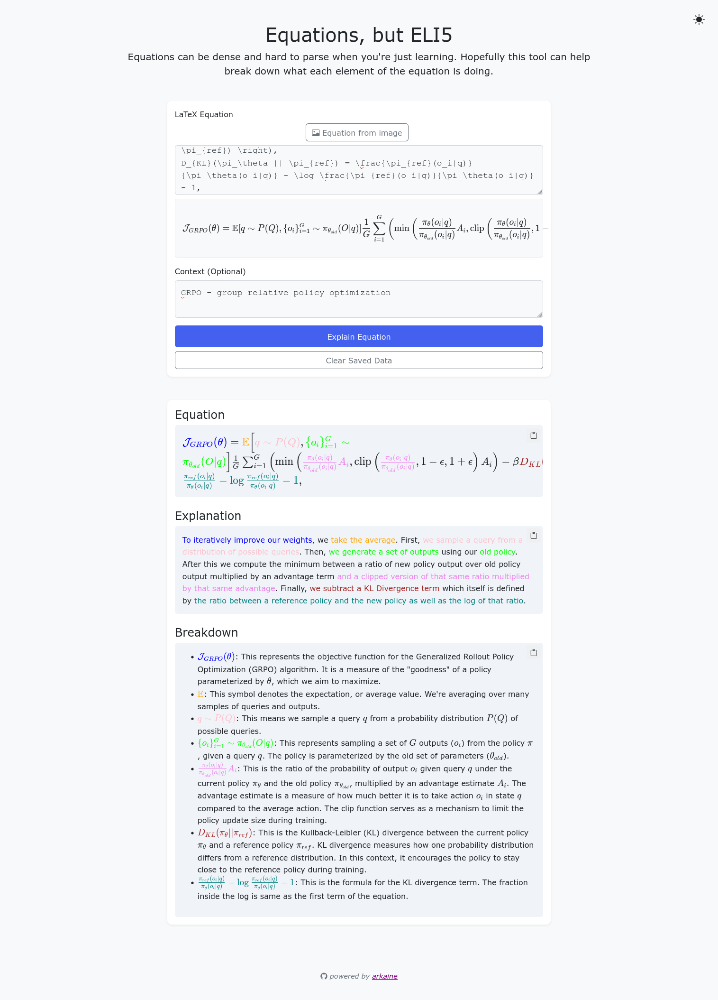

# eli5-equations

Given an equation in latex form (or an image of an equation) generate a clear explanation of what the equation is doing.

A quick prototype built with [arkaine](https://github.com/hlfshell/arkaine).



## Instructions
You require an API key for Google's generative AI services to get this to run.

### Local:
```
pip install -r requirements.txt
export GOOGLE_AISTUDIO_API_KEY=<your-key-here>
python app.py
```

### Docker:
`docker run -p 5000:5000 -e GOOGLE_AISTUDIO_API_KEY=$(echo $GOOGLE_AISTUDIO_API_KEY) hlfshell/eli5-equations`
